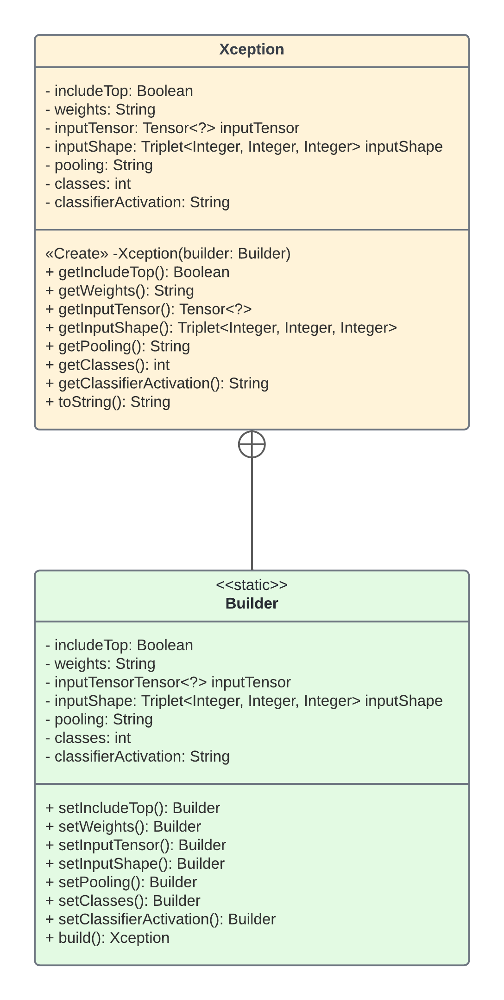
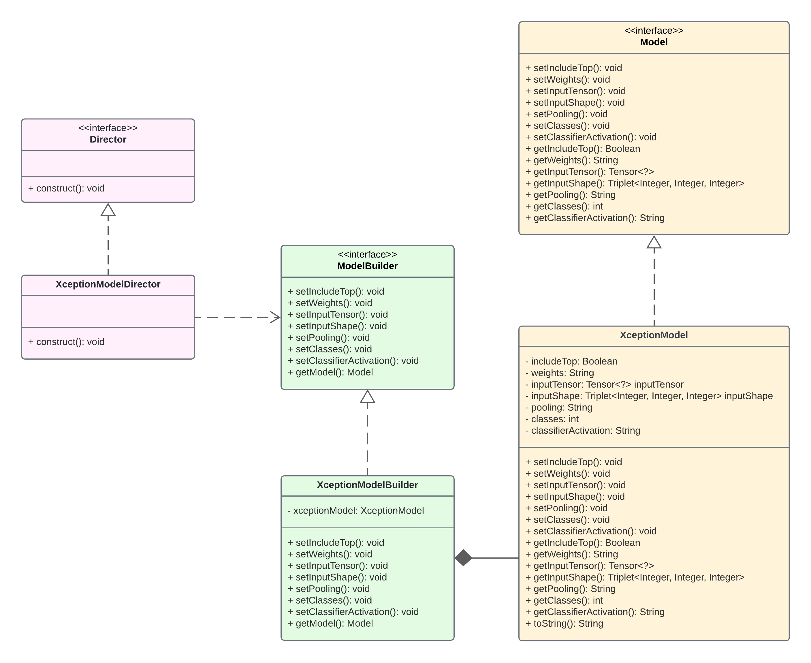

# :hammer: Builder Design Pattern


This project explores the builder design pattern in depth by developing two applications using
the Joshua Bloch Approach and the Gang of Four Approach.

**Use case scenario**: A machine learning engineer wants to instantiate Xception, 
which is an implementation of the Xception neural network model in DeepLearning4j, 
objects while avoiding constructor pollution. 

## Contents

- [Technologies](#technologies)
- [Implementation Description](#implementation-description)
- [UML Diagram](#uml-diagram)
- [Installation](#pinstallation)

## Technologies


## Implementation Description

### Builder Design Pattern

Builder is a creational design pattern that aims to "separate the construction of a complex object from its
representation so that the same construction process can create different representations" [4]. That is to say, it
lets us create different types of "an object using the same construction code" [2]. This is useful for when a
constructor has a lot of optional parameters, and thus a lot of optional parameter combinations. Builder design
pattern offers a solution to this "telescoping constructor anti-pattern" [3]. Interestingly, there are two different
versions of the builder design pattern. For this project, I have implemented and discussed both.

### Joshua Bloch Approach

This is a shorthand version of the builder design pattern. It "consists of only 2 components: the ConcreteBuilder and
the Product" [5]. Builder is nested static class located inside the Product class. The values for the optional fields
are set by calling the setter methods of the Builder class. Once the fields are set, the build method on the Builder
instance is called. The build method then "creates the Product by passing the previously set values to the Product’s
constructor, and it eventually returns a new Product instance" [5]. This version has the following participants:

- Product: (**Xception**) can only be created through the builder. It has a private constructor.
- ConcreteBuilder: (**Builder**) is the static nested class inside Product. It has the same variables as Product and
  its setter-like methods return the builder itself, which is useful "to chain the builder method calls" [5].

+ PROS: really fluent design (method calls can be chained!), can reuse existing builder instances to build new products
+ CONS: cannot create Xception directly, code duplication (product and concrete builder have the same fields), verbose

### Gang of Four Approach

The above version is a shorthand form of this version, i.e, the Gang of Four approach. In this version, the builder is
not a static class nested inside the product. Instead, it is a separate class that creates the product. Moreover, this
version consists of 2 additional components: the Builder and the Director. Below is a summary of each component.

- Builder: (**ModelBuilder**) "specifies an interface for creating various parts of a Product" [7].
- ConcreteBuilder: (**XceptionModelBuilder**) "implements the builder interface, builds the parts of the Product, and
  provides a method for getting the built Product" [6].
- Director: (**XceptionModelDirector**) "constructs an object using the Builder interface" [7].
- Product: (**XceptionModel** ) "is the object that we are constructing" [6].

+ PROS: defers construction steps to the Director, fully constructed product will be available to client
+ CONS: code duplication, verbose, not a fluent design (method calls cannot be chained), requires creating new classes

### Software Design Concepts

- Sufficiency: both satisfy the requirement of avoiding telescopic constructors
- Understandability: the Bloch approach is very easy to understand
- Modularity: the GoF approach is divided into well divided packages: builder, director, product
- Cohesion: like-minded elements are grouped together. Ex: Model, XceptionModel
- Coupling: construction of product object is separate from its representation
- Robustness: both versions can deal with all the optional parameter combinations
- Flexibility: requirement changes can be easily handled by implementing interfaces
- Reusability: the bloch approach can easily reuse existing builder instances to build new products
- information hiding: directors handle construction, so fully built product can be available to clients

## UML Diagram

### Joshua Bloch Approach



### Gang of Four Approach



## Installation 

### How to compile the project

We use Apache Maven to compile and run this project.

You need to install Apache Maven (https://maven.apache.org/)  on your system.

Type on the command line:

```bash
mvn clean compile
```

### How to create a binary runnable package

```bash
mvn clean compile assembly:single
```

### How to run

```bash
mvn -q clean compile exec:java -Dexec.executable="edu.bu.met.cs665.Main" 
```

### Run all the unit test classes.

```bash
mvn clean compile test checkstyle:check  spotbugs:check
```

### Using Spotbugs to find bugs in your project

To see bug detail using the Findbugs GUI, use the following command "mvn findbugs:gui"

Or you can create a XML report by using

```bash
mvn spotbugs:gui 
```

or

```bash
mvn spotbugs:spotbugs
```

```bash
mvn spotbugs:check 
```

check goal runs analysis like spotbugs goal, and make the build failed if it found any bugs.

For more info see
https://spotbugs.readthedocs.io/en/latest/maven.html

SpotBugs https://spotbugs.github.io/ is the spiritual successor of FindBugs.

### Run Checkstyle

CheckStyle code styling configuration files are in config/ directory. Maven checkstyle plugin is set to use google code
style. You can change it to other styles like sun checkstyle.

To analyze this example using CheckStyle run

```bash
mvn checkstyle:check
```

This will generate a report in XML format

```bash
target/checkstyle-checker.xml
target/checkstyle-result.xml
```

and the following command will generate a report in HTML format that you can open it using a Web browser.

```bash
mvn checkstyle:checkstyle
```

```bash
target/site/checkstyle.html
```

## References

- [1] Goals of Software Design PPT
- [2] https://refactoring.guru/design-patterns/builder
- [3] https://java-design-patterns.com/patterns/builder/
- [4] https://www.geeksforgeeks.org/builder-design-pattern/
- [5] https://blogs.oracle.com/javamagazine/post/exploring-joshua-blochs-builder-design-pattern-in-java
- [6] https://javadevcentral.com/effective-java-builder-pattern
- [7] https://www.dofactory.com/net/builder-design-pattern


